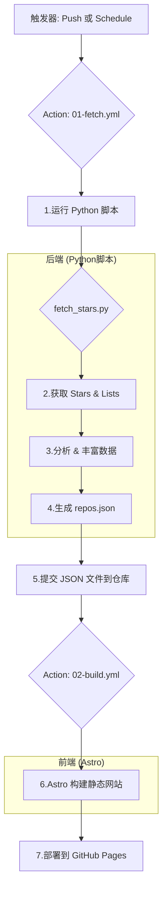

# 🌟 My Gitstar

A Github Collection Management Project.

[](https://choosealicense.com/licenses/mit/)


对于许多开发者来说，GitHub 的“Star”功能是收藏优秀项目的重要方式。然而，随着星标仓库数量的增长，如何高效地分类、检索和展示这些收藏变成了一个挑战。

`My Gitstar Manager` 项目的启动源于一个探索性的问题：**我们能否不依赖任何传统的后端服务器，仅使用 GitHub 提供的原生工具，来构建一个功能完备的个人星标仓库管理系统？**

这个项目就是对上述问题的回答。它证明了通过巧妙地组合 `GitHub Actions`、`Git` 版本控制系统以及 `GitHub Pages`，我们可以实现一个完全自动化的工作流，用于：

1. 定期获取我所有的星标仓库。
2. 通过智能分析（平台、技术栈等）丰富数据维度。
3. 将处理后的数据以 `JSON` 格式存回仓库。
4. 自动构建一个美观、可交互的前端网站。
5. 将最终的网站部署到 `GitHub Pages` 上供公开访问。

## ✨ 核心理念：GitOps 与“无后端”

本项目的核心架构是一种“GitOps”的实践。我们不部署数据库或后端 API 服务，而是将 **Git 仓库本身作为我们的数据存储和状态管理的中心**。

整个工作流完全自动化，并通过 GitHub Actions 编排，其流程如下：



这种方法的优势在于：

* **零成本**：完全利用 GitHub 的免费额度。
* **高可用**：依赖于 GitHub 平台的稳定性。
* **版本控制**：每一次数据更新都有完整的 Git 提交历史，可追溯、可回滚。
* **透明化**：所有的数据和构建逻辑都在仓库中，一目了然。

## 🚀 功能特性

* **自动数据同步**：通过 GitHub Actions 定期或手动触发，自动拉取最新的星标仓库列表和自定义分类（Lists）。
* **智能平台分析**：自动分析每个仓库的 `topics`、`language` 和 `description`，为其打上平台标签（如 `Windows`, `Web`, `iOS`, `Cross-platform` 等）。
* **交互式数据表格**：
  * 使用 `DataTables.js` 提供功能强大的表格视图。
  * 支持对仓库名称、描述进行全文搜索。
  * 支持对集合（Collection）、平台（Platform）、语言（Language）进行多选过滤。
  * 支持按列排序和自定义列可见性。
* **多视图展示**：项目前端架构支持多种视图切换（当前已实现 `Doc` 和 `Table` 视图，`Kanboard` 视图正在规划中）。
* **Git 即数据库**：所有处理后的数据以 `repos.json` 的形式存储在仓库中，作为前端应用的数据源。

## 🛠️ 技术栈

* **自动化/CI/CD**: **GitHub Actions** (`01-fetch.yml`, `02-build.yml`)
* **数据处理**: **Python 3.10**
  * `gh_toolkit`: 自定义工具包，封装了对 GitHub REST/GraphQL API 的调用和网页抓取逻辑。
* **前端框架**: **Astro**
  * `@astrojs/starlight`: 用于快速构建文档风格的页面布局。
  * `RepositoryTable.astro`: 核心的交互式表格组件。
* **前端样式**: **Tailwind CSS**，用于快速构建现代化 UI，并与 Starlight 主题深度整合。
* **部署**: **GitHub Pages**

## 📂 项目结构

```bash
.
├── .github/workflows/         # GitHub Actions 工作流
│   ├── 01-fetch.yml           # 拉取、分析数据并提交
│   └── 02-build.yml           # 构建并部署前端应用
├── app/                       # 前端 Astro 应用
│   ├── src/
│   │   ├── components/        # Astro 组件 (表格、头部等)
│   │   ├── layouts/           # 页面布局
│   │   ├── pages/             # 页面路由
│   │   └── content/           # 由 Action 生成的数据 (json, md, csv)
│   ├── astro.config.mjs       # Astro 配置文件
│   └── tailwind.config.ts     # Tailwind CSS 配置文件
└── scripts/                   # 后端数据处理脚本
    ├── gh_toolkit/            # 自定义 GitHub API 工具包
    └── fetch_stars.py         # 主数据处理脚本
```

## ⚙️ 本地开发与设置

### 1. 后端脚本

后端脚本负责从 GitHub 拉取数据。

```bash
# 1. 进入脚本目录
cd scripts

# 2. 安装依赖 (推荐在虚拟环境中进行)
pip install -r requirements.txt

# 3. 设置环境变量
# 创建一个 .env 文件或直接在终端中设置
# GH_TOKEN 是你的 GitHub Personal Access Token
# 需要 'repo', 'read:user', 'write:lists' 权限
export GH_TOKEN="your_github_pat"

# 4. 运行脚本
python fetch_stars.py
```

执行成功后，会在 `scripts/dist` 目录下生成 `repos.json`, `repos.csv`, `starred-repos.md` 文件。

### 2. 前端应用

前端应用负责展示数据。

```bash
# 1. 进入应用目录
cd app

# 2. 安装 Node.js 依赖
npm install

# 3. 将后端生成的数据移动到前端内容目录
# (在自动化流程中，这一步由 GitHub Action 完成)
# 手动操作：
# mv ../scripts/dist/repos.json ./src/content/

# 4. 启动开发服务器
npm run dev
```

现在，你可以在浏览器中访问 `http://localhost:4321` 来查看应用。

## 🔮 未来计划

本项目作为一个探索性的实践，拥有广阔的扩展空间。一些未来的想法包括：

* **AI 赋能**：集成大型语言模型（LLM）的 API，实现：
  * **自动摘要**：为没有描述的仓库自动生成一句话摘要。
  * **智能分类**：根据仓库的 `README` 和代码，推荐更精准的分类或标签。
  * **问答系统**：建立一个可以基于所有星标仓库内容进行问答的系统。这与一些前沿探索的方向一致，即如何让 LLM 更好地理解和回答关于代码仓库的问题 [Best way to feed a GitHub repo to a LLM and have it answer ...](https://www.reddit.com/r/ChatGPTCoding/comments/1fjd3yd/best_way_to_feed_a_github_repo_to_a_llm_and_have/){target="_blank" class="gpt-web-url"}。
* **看板视图 (Kanboard View)**：增加一个看板视图，允许用户通过拖拽的方式在不同的自定义列表（Lists）之间移动仓库。
* **数据可视化**：增加图表，用于分析星标仓库的语言分布、平台趋势等。

## 📜 许可证

本项目采用 [MIT License](./LICENSE) 授权。

## 参考/知识来源

* [Astro](https://docs.astro.build/en/getting-started/)
* [Starlight](https://starlight.astro.build/getting-started/)
* [nhtlongcs/StarListify](https://github.com/nhtlongcs/StarListify)
* [haile01/github-starred-list](https://github.com/haile01/github-starred-list)
